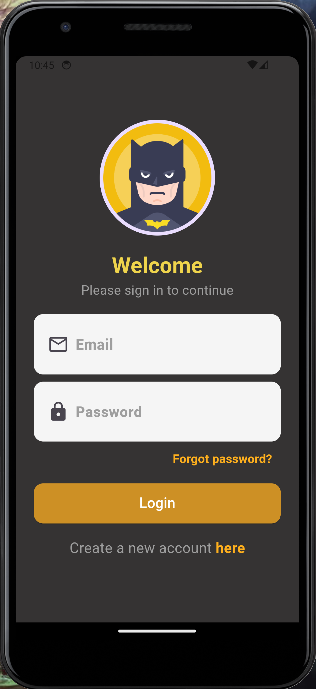
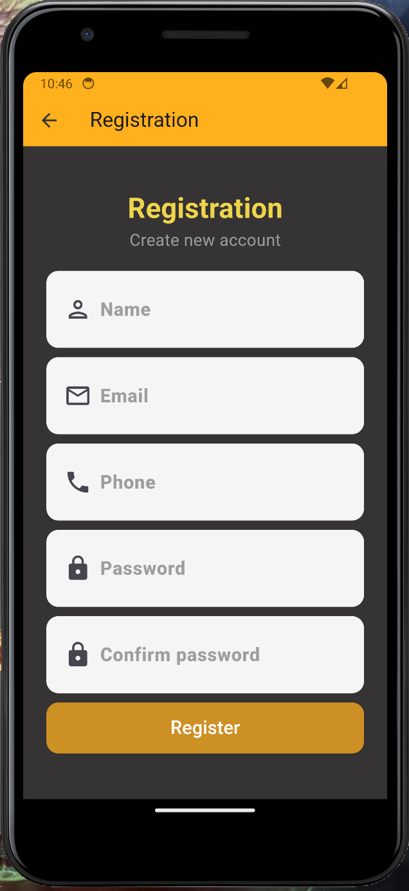
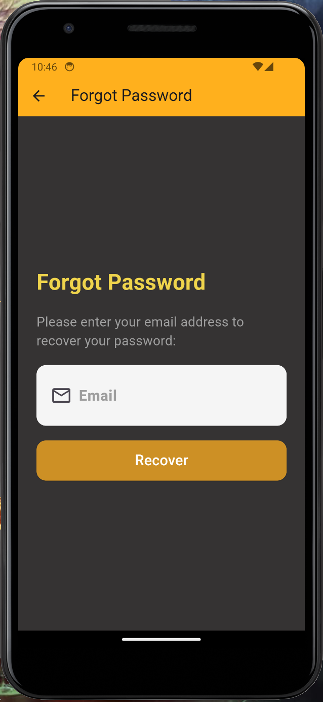

# FLUTTER
## Login and Registration App

---
## Description
This system allows users to log in, register and recover passwords.

#### Login
Functions:
Entering login and password: The user enters his credentials.

#### Registration
Functions:
Data entry: The user enters name, email, phone number and password.

#### Password recovery
* Functions:
* Request for recovery: The user enters his email.
* Sending instructions: The system sends instructions for resetting your password by email.

***
<!-- 
## Main functions:
 -->

## Image

|  Welcome  |   Registration  |    Password  |
|:-------------:|:------------------:|:-------------------:|
||||

*** 

### OBS
This is the working basis of user identification. All buttons and logic work without problems. At the moment there is no connection to FIREBASE yet.
<!-- ## Video

[] -->

___
[Up](#anchor)
